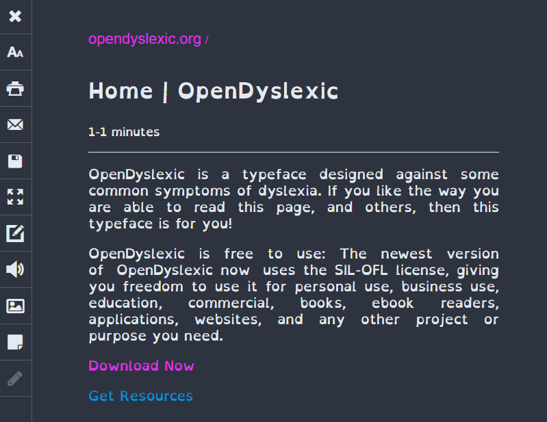

# Chrome Reader View Open Dyslexic Font Server

Server for local font files & integration with Chrome Reader View custom css.

## Prerequisites

Requires npm.

## Setup

1. Install chrome Reader View extension.

2. Go download the fonts, and give them a tip. They did an amazing job on the font. [opendyslexic.org](https://opendyslexic.org/)

3. Layout the fonts in a flat structure in your home directory. 
    - ~/Fonts/OpenDyslexic-Bold.otf
    - ~/Fonts/OpenDyslexic-BoldItalic.otf
    - ~/Fonts/OpenDyslexic-Italic.otf
    - ~/Fonts/OpenDyslexicMono-Regular.otf
    - ~/Fonts/OpenDyslexic-Regular.otf

4. In the reader view custom styling section paste: [chrome_reader_settings.css](chrome_reader_settings.css)

5. Start the server, runs on port 61719.

`npm install
npm run start`

## Configure as startup program  (Windows Only)

Make a shortcut to [start_font_server.bat](start_font_server.bat) and copy it to `C:\ProgramData\Microsoft\Windows\Start Menu\Programs\Startup`
